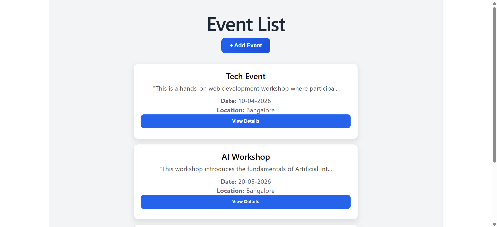
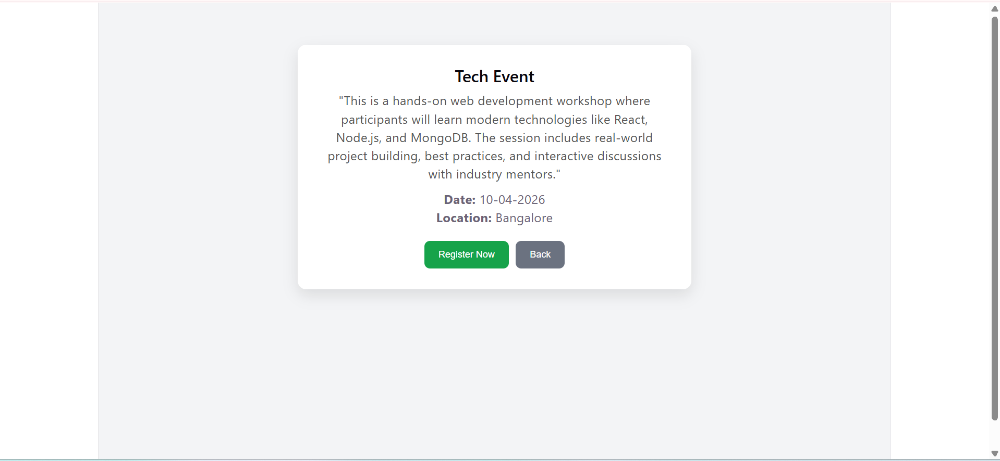
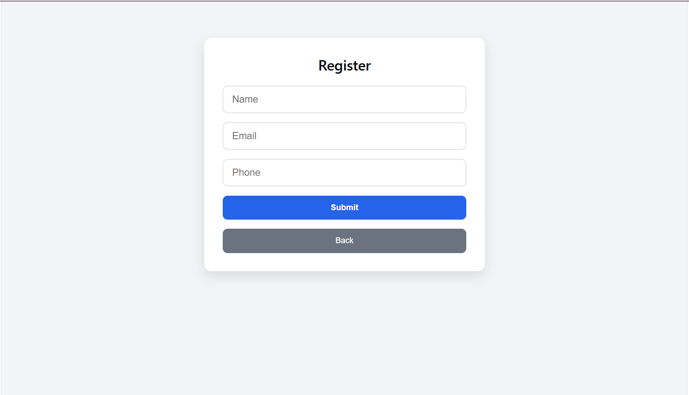
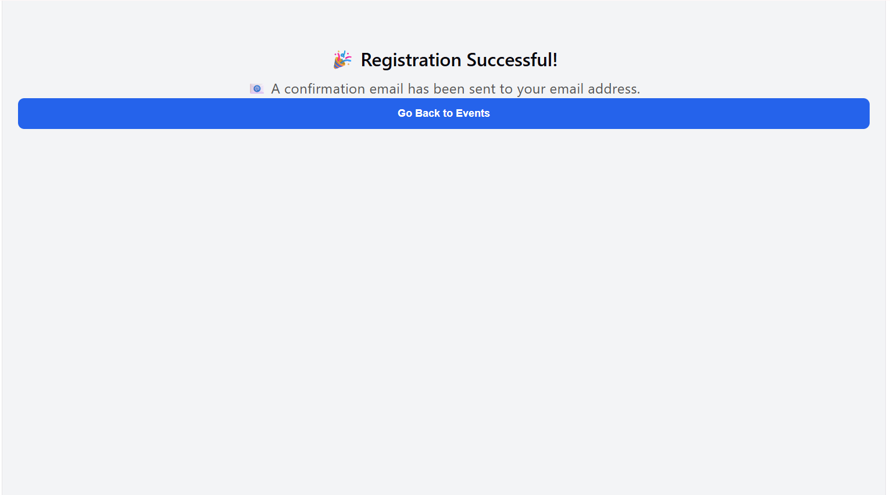

# 🔗 Event Registration System

A full-stack web application built using React, Node.js, and MongoDB where users can view events and register for them.

---

## Tech Stack

* Frontend: React (Vite)
* Backend: Node.js with Express
* Database: MongoDB
* API: REST APIs

---

## Features

### Frontend

* Event List Page
* Event Details Page
* Event Registration Form
* Registration Success Page
* Responsive UI

### Backend

* Create and fetch events
* Register users for events
* Fetch registered users for a specific event
* Input validation and proper error handling

---

## Bonus Features

* Admin panel to add events
* Prevent duplicate registrations
* Mock email confirmation

---

## Project Structure

/frontend → React (Vite)
/backend → Node.js + Express

---

## Setup Instructions

### 1. Clone the repository

```bash id="r7a2f2"
git clone https://github.com/livithaa/event-registration-system.git
cd event-registration-system
```

---

### 2. Install dependencies

#### Frontend

```bash id="t2nqyx"
cd frontend
npm install
npm run dev
```

#### Backend

```bash id="e6c1xp"
cd backend
npm install
npm start
```

---

### 3. Configure MongoDB

Create a `.env` file inside backend folder:

```env id="w8v4rk"
MONGO_URI=your_mongodb_connection_string
PORT=5000
```

---

## API Documentation

### Events APIs

#### GET /api/events

Fetch all events

#### POST /api/events

Create a new event

Request Body:

```json id="bt5mzt"
{
  "name": "Event Name",
  "description": "Event description",
  "date": "YYYY-MM-DD",
  "location": "City"
}
```

---

### Registration APIs

#### POST /api/register

Register a user for an event

Request Body:

```json id="1ecb9l"
{
  "eventId": "event_id",
  "name": "User Name",
  "email": "user@email.com",
  "phone": "1234567890"
}
```

#### GET /api/register/:eventId

Fetch all users registered for a specific event

---

## How It Works

1. Users can view available events
2. Click on "View Details" to see full information
3. Register for an event using the form
4. After successful registration, a confirmation message (mock email) is displayed
5. Admin can add new events using the admin panel

---

## Project Explanation

This application is a full-stack event registration system built using React, Node.js, and MongoDB.

The frontend provides a clean and responsive interface where users can browse events, view details, and register easily. Form validation is implemented to ensure correct user input.

The backend exposes REST APIs to manage events and registrations. It includes proper validation, error handling, and prevents duplicate registrations for the same event.

MongoDB is used to store event data and user registrations efficiently.

Additionally, the project includes bonus features like a simple admin panel to add events and a mocked email confirmation to simulate real-world behavior.

---

## Screenshots

### Event List



### Event Details



### Event Registration



### Registration Success



---

## Author

Livitha A

---

## Notes

This project was developed as part of an internship assignment to demonstrate full-stack development skills including frontend, backend, API integration, and database management.
